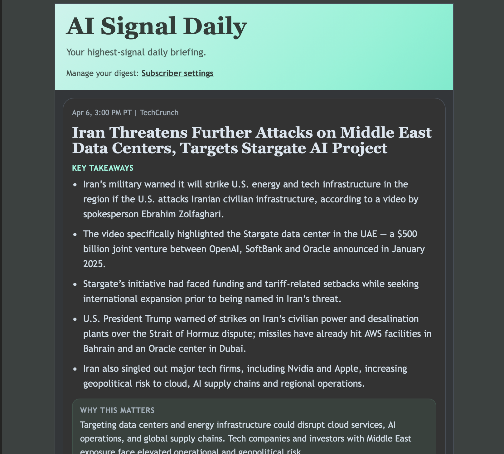

# Newsletter Curator

Personal newsletter curator with a repository-first architecture: Gmail newsletters and publisher feeds are ingested into a local SQLite repository, then a daily orchestrator ranks, summarizes, and emails the digest from stored snapshots.

Subscribe to the live newsletter: <https://buttondown.com/zeizyynewsletter> to get something like this everyday:



## Features
- Separate debug-friendly ingest jobs for Gmail newsletters and additional publisher feeds
- Single daily orchestrator for production cron scheduling
- Local SQLite repository for normalized stories, article snapshots, and run history
- Admin UI for source selection plus subscriber login and settings
- Repo-only delivery job with no live Gmail reads or live article fetches at send time
- Two-stage LLM flow: persona-neutral ingest scoring and summaries, followed by persona-aware final ranking
- Final selection quotas by source type (default: `gmail=10`, `additional_source=5`)
- Delivery readiness checks against ingest run history and stored fresh stories
- Deterministic canned-data mode for local development and integration testing

## Pipeline Design
1) `daily_pipeline.py` is the production entrypoint. It runs Gmail ingest, source ingest, then digest delivery in sequence.
2) `fetch_gmail.py` and `fetch_sources.py` remain available as manual debug or backfill entrypoints.
3) `deliver_digest.py` remains available as a manual send or cache-regeneration entrypoint.
4) Delivery reads only repository-backed stories within the configured freshness windows.
5) Delivery merges Gmail + additional-source candidates, dedupes by URL, ranks with `openai.reasoning_model`, applies source quotas, summarizes stored article text with `openai.summary_model`, and emails the digest.
6) Delivery records run metadata and warns when one source type is stale or has a failed latest ingest, but can still proceed if another source type has fresh repository data.

Runtime output includes:
- repository readiness by source type
- links retrieved from repository by source type
- ranked/final counts sliced by source type and source name
- summary completion/backfill/skip counts
- per-model token usage
- JSON output from each standalone job entrypoint

## Requirements
- Python 3.13+
- `uv` (recommended)
- Google OAuth credentials for Gmail API
- OpenAI API key

## Setup
1) Place Gmail OAuth credentials at `secrets/credentials.json`.
2) Install dependencies:
```bash
uv sync
```
3) Set your OpenAI key:
```bash
export OPENAI_API_KEY="your_key_here"
```
4) Optional: if you want delivery recipients to come from Buttondown first, set:
```bash
export BUTTONDOWN_API_KEY="your_buttondown_api_key_here"
```
5) Review and edit `config.yaml`.

## Run
Production default:

```bash
uv run python daily_pipeline.py
```

Manual debug entrypoints:

```bash
uv run python fetch_gmail.py
uv run python fetch_sources.py
uv run python deliver_digest.py
```

Read-only MCP story feed:

```bash
uv run python scripts/newsletter_mcp_server.py --config-path config.yaml
```

This launches a newline-delimited stdio MCP server. It exposes one tool, `list_recent_stories`, backed by the existing SQLite repository and returns only stored metadata from the last 24 hours. It does not trigger fresh retrieval, article fetching, or summarization.

If you already export `NEWSLETTER_CONFIG`, `--config-path` is optional. For local launch details:

```bash
uv run python scripts/newsletter_mcp_server.py --help
```

Repo-local Codex plugin publish path:

- plugin root: `plugins/newsletter-curator-story-feed`
- plugin manifest: `plugins/newsletter-curator-story-feed/.codex-plugin/plugin.json`
- MCP server manifest: `plugins/newsletter-curator-story-feed/.mcp.json`
- local marketplace entry: `.agents/plugins/marketplace.json`

The published plugin launches the checked-in MCP server through:

```bash
uv run python ../../scripts/newsletter_mcp_launch.py --local-config-path ../../config.yaml
```

That command is stored in the plugin-local `.mcp.json` and is intended to run from the plugin root.

By default it targets the real curator host over SSH and runs the checked-in read-only MCP server there:

```bash
ssh -T root@159.65.104.249 \
  'cd /root/newsletter_curator && exec uv run python scripts/newsletter_mcp_server.py --config-path config.yaml'
```

That means the SQLite file is read locally on the production server instead of over the network.

The published defaults are:

```bash
export CURATOR_MCP_TARGET=ssh
export CURATOR_MCP_SSH_HOST=159.65.104.249
export CURATOR_MCP_SSH_USER=root
export CURATOR_MCP_REMOTE_REPO_DIR=/root/newsletter_curator
export CURATOR_MCP_REMOTE_CONFIG_PATH=config.yaml
```

Use `CURATOR_MCP_TARGET=local` during development if you want the published plugin to read the repo-local SQLite database through `../../config.yaml` instead.

If `CURATOR_MCP_SSH_HOST` is set manually, it must be a raw SSH host or IP. URL-shaped values like `http://159.65.104.249` are rejected intentionally so they are never emitted into the SSH command.

Remote HTTP MCP endpoint on the admin host:

- endpoint: `https://YOUR_PUBLIC_CURATOR_HOST/mcp`
- auth: `Authorization: Bearer $CURATOR_MCP_TOKEN`
- fallback auth for older setups: `X-Admin-Token: $CURATOR_ADMIN_TOKEN`

This endpoint serves the same read-only `list_recent_stories` tool over Streamable HTTP-style POST requests on the existing Flask/admin host. The current implementation is stateless and returns JSON responses over `POST`; it intentionally returns `405 Method Not Allowed` on `GET`, which is allowed for servers that do not offer an SSE stream.

Example initialize request:

```bash
curl -sS \
  -H 'Authorization: Bearer YOUR_MCP_TOKEN' \
  -H 'Accept: application/json, text/event-stream' \
  -H 'Content-Type: application/json' \
  -H 'MCP-Protocol-Version: 2025-11-25' \
  https://YOUR_PUBLIC_CURATOR_HOST/mcp \
  -d '{"jsonrpc":"2.0","id":1,"method":"initialize","params":{"protocolVersion":"2025-11-25","capabilities":{},"clientInfo":{"name":"manual","version":"0.0.0"}}}'
```

Example tool call:

```bash
curl -sS \
  -H 'Authorization: Bearer YOUR_MCP_TOKEN' \
  -H 'Accept: application/json, text/event-stream' \
  -H 'Content-Type: application/json' \
  -H 'MCP-Protocol-Version: 2025-11-25' \
  https://YOUR_PUBLIC_CURATOR_HOST/mcp \
  -d '{"jsonrpc":"2.0","id":2,"method":"tools/call","params":{"name":"list_recent_stories","arguments":{"hours":24}}}'
```

If you bootstrap the server with `scripts/bootstrap_server.py`, it now writes `CURATOR_MCP_TOKEN` into the generated env file. By default that token matches `CURATOR_ADMIN_TOKEN`; pass `--mcp-token` if you want a separate read-only token for shared MCP access.

For an end-to-end delivery dry run that sends only to one test inbox:

```bash
uv run python deliver_digest.py --dry-run-recipient you@example.com
```

For an offline subprocess E2E run that exercises the full ingest + delivery stack with fixture data and
prints stage runtime / memory-watermark diagnostics:

```bash
uv run python scripts/run_offline_e2e_fixture.py --scenario main_flow
uv run python scripts/run_offline_e2e_fixture.py --scenario smoke
uv run python scripts/run_offline_e2e_fixture.py --scenario memory_stress --max-rss-mb 512
```

For the corresponding pytest coverage:

```bash
uv run pytest tests/integration/test_offline_e2e_fixture_runner.py -q
```

`main.py` is kept as a compatibility wrapper for the delivery path.

First Gmail-authenticated run will open a browser for Google OAuth and create `secrets/token.json`.

If you change Gmail scopes later, delete `secrets/token.json` and re-run to re-auth.

## Deploy On A Server
Use this when hosting the curator on a server. The intended production flow is:
- a long-running admin server for config and preview
- one daily `daily_pipeline.py` cron run

### One-Time Bootstrap
The repo includes a one-shot bootstrap script that generates:
- a locked-down env file used by all jobs
- wrapper scripts for the admin server, the single daily job, and the manual debug jobs
- a `systemd --user` service for the admin server
- a cron file for the single daily orchestrator schedule

Run once on the server:
```bash
cd /root/newsletter_curator
uv sync
OPENAI_API_KEY='your_key' uv run python scripts/bootstrap_server.py \
  --repo-dir /root/newsletter_curator \
  --admin-host 0.0.0.0 \
  --admin-port 8080 \
  --public-base-url 'https://curator.example.com' \
  --admin-token 'choose-a-long-random-token' \
  --buttondown-api-key 'your_buttondown_api_key' \
  --enable-telemetry \
  --enable-linger \
  --install-crontab
```

What this writes by default:
- `deploy/generated/newsletter-curator.env`
- `deploy/generated/start_admin_server.sh`
- `deploy/generated/run_daily_pipeline.sh`
- `deploy/generated/run_fetch_gmail.sh`
- `deploy/generated/run_fetch_sources.sh`
- `deploy/generated/run_deliver_digest.sh`
- `deploy/generated/newsletter_curator.cron`
- `deploy/generated/newsletter-curator-admin.service`

What the script installs when flags are passed:
- `--install-systemd-user`: copies the generated admin service into `~/.config/systemd/user/`, reloads `systemd --user`, and enables it immediately
- rerunning the bootstrap is safe: it regenerates assets, reloads the user unit, and restarts the admin service so wrapper/env updates are picked up
- `--install-crontab`: installs the generated cron file as the current user’s crontab
- `--enable-linger`: runs `loginctl enable-linger $USER` so the `systemd --user` admin service survives SSH logout

Notes:
- The bootstrap does not start the admin app unless you explicitly pass `--install-systemd-user`.
- The script reads `OPENAI_API_KEY` from the current environment if `--openai-api-key` is not passed explicitly.
- The script reads `BUTTONDOWN_API_KEY` from the current environment if `--buttondown-api-key` is not passed explicitly.
- Telemetry tracking is now disabled by default. Pass `--enable-telemetry` only when the `/track/*` endpoints are publicly reachable.
- Set `--public-base-url` to the externally reachable admin origin for subscriber login links, telemetry links, and open-tracking pixels. If you access the server directly on a non-default port such as `:8080`, include that port in the URL.
- The generated env file stores the admin token, OpenAI key, and optional Buttondown key with `0600` permissions, so run the bootstrap as the same server user that will own the service and cron jobs.
- The generated cron schedule defaults to:
  - `30 14 * * *` run `daily_pipeline.py`
- The default cron output now uses fixed UTC times instead of `CRON_TZ`, because some cron daemons ignore `CRON_TZ`.
- `30 14 * * *` corresponds to `6:30 AM PST` exactly. On March 22, 2026 Los Angeles is on PDT, so that same fixed UTC schedule currently lands at `7:30 AM` local.
- Fixed UTC does not automatically follow DST, so update the schedule manually if you want a different winter/summer local time mapping.
- Override schedules with:
  - `--daily-schedule`
  - `--cron-timezone` if your cron daemon reliably supports it and you want timezone-based scheduling

### Server Prerequisites
Before running the bootstrap:
- place Gmail OAuth credentials at `secrets/credentials.json`
- create `secrets/token.json` once with an interactive Gmail-authenticated run if needed
- ensure `uv` is installed and on `PATH`

### Verification
After bootstrap:
```bash
crontab -l
tail -n 200 /root/newsletter_curator/deploy/generated/cron.log
```

If you chose to install the admin service too:
```bash
systemctl --user status newsletter-curator-admin
```

For a one-off server-side dry run through the generated wrapper:

```bash
./deploy/generated/run_deliver_digest.sh --dry-run-recipient you@example.com
```

Open the admin UI:
```text
http://YOUR_SERVER:8080/admin/login
```

### Dry-Run Asset Generation
If you want to inspect the generated assets before installing anything:
```bash
cd /root/newsletter_curator
OPENAI_API_KEY='your_key' uv run python scripts/bootstrap_server.py \
  --repo-dir /root/newsletter_curator \
  --output-dir /root/newsletter_curator/deploy/generated-preview \
  --admin-host 0.0.0.0 \
  --admin-port 8080 \
  --admin-token 'choose-a-long-random-token'
```

This generates all deploy files without touching `systemd` or `crontab`.

## Web Config UI
Run a local admin UI to edit `config.yaml`:

```bash
uv run python admin_app.py
```

Default URL is `http://127.0.0.1:8080`.

Optional security token:
- Set `CURATOR_ADMIN_TOKEN` on the server.
- Browser access uses `/admin/login`, which sets an HttpOnly admin session cookie after validating the token.
- Scripted access can still send `X-Admin-Token: ...`.

Optional Buttondown recipient sync:
- Set `BUTTONDOWN_API_KEY` on the server.
- Delivery will fetch active subscribers from Buttondown first and fall back to `email.digest_recipients` if the API key is missing, the API request fails, or Buttondown returns no deliverable subscribers.

Optional host/port overrides:
- `CURATOR_ADMIN_HOST` (default `127.0.0.1`)
- `CURATOR_ADMIN_PORT` (default `8080`)
- `CURATOR_ADMIN_ENABLE_PREVIEW=1` enables live `/preview` generation. By default the admin app runs in lightweight debug mode and only serves read-only repository views plus any already-stored newsletter for today.
- `CURATOR_ADMIN_RERENDER_STORED_NEWSLETTERS=1` is now only a legacy fallback for stored newsletters that do not have cached `render_groups`. When `render_groups` exist, cached admin previews render from stored content automatically.

Local screenshot review pack for a stored newsletter:
```bash
uv run python scripts/render_preview_review_pack.py \
  --config-path config.yaml \
  --newsletter-date 2026-03-25
```

This is a macOS-only inspection helper that uses Quick Look (`qlmanage`) to write HTML fixtures plus PNG screenshots into a temp or explicit output directory.

Browser-driven admin/subscriber regression harness with seeded local data:
```bash
uv run python scripts/run_admin_ui_e2e_harness.py
```

This starts a temporary local `admin_app.py`, drives the subscriber login/settings flow plus the admin preview flow through Playwright, saves screenshots into `output/playwright/admin-ui-e2e/`, and writes a `manifest.json` with the saved-profile assertions and artifact paths.

For the corresponding pytest coverage:
```bash
uv run pytest tests/integration/test_admin_ui_e2e_harness.py -q
```

If you want Codex to stop asking for one-off approval on every Playwright subcommand, prefer approving a stable repo-local prefix such as:
- `["uv", "run", "python", "scripts/run_admin_ui_e2e_harness.py"]`
- or, if you are comfortable granting a broader reusable rule, `["uv", "run", "python"]`

That is more durable than approving long shell lines with `export CODEX_HOME=... && bash "$PWCLI" ...`, because the exact command text changes across steps and misses the prefix matcher.

## Configuration
Edit `config.yaml`:
- `gmail.label` (default `Newsletters`)
- `gmail.query_time_window` (default `newer_than:1d`)
- `database.path` (default `data/newsletter_curator.sqlite3`)
- `persona.text`
- `development.use_canned_sources`
- `development.canned_sources_file`
- `development.fake_inference`
- `additional_sources.enabled` (default `true` in current checked-in config)
- `additional_sources.script_path` (default `skills/daily-news-curator/scripts/build_daily_digest.py`)
- `additional_sources.feeds_file` (optional custom feed list for the source script)
- `additional_sources.hours`, `additional_sources.top_per_category`, `additional_sources.max_total`
- `limits.max_links_per_email`
- `limits.select_top_stories`
- `limits.max_per_category`
- `limits.final_top_stories` (default `15`)
- `limits.source_quotas` (default `gmail: 10`, `additional_source: 5`)
- `limits.max_article_chars`
- `limits.max_summary_workers`
- `openai.reasoning_model` (default `gpt-5-mini`)
- `openai.summary_model` (default `gpt-5-mini`)
- `tracking.enabled` (default `false`)
- `tracking.base_url` (optional; falls back to `CURATOR_PUBLIC_BASE_URL` or the admin host and port)
- `email.digest_recipients` and `email.alert_recipient`

### Persona Behavior
`persona.text` now affects only the final delivery ranking step.

Ingest scoring and stored article summaries are persona-neutral, so the same stored repository data can be reused across subscribers. Persona only changes which already-stored stories make the final delivered digest.

### Subscriber Personalization
Subscriber personalization now lives in SQLite, not in `config.yaml` or Buttondown metadata.

Delivery recipient membership is still resolved in this order:
- `--dry-run-recipient`
- Buttondown active subscribers when `BUTTONDOWN_API_KEY` is set
- `email.digest_recipients`

Resolved recipients are automatically upserted into the `subscribers` table during delivery so the DB becomes the durable recipient registry over time. Personalization only comes from the matching `subscriber_profiles` row:
- blank or missing `persona_text` falls back to the global `persona.text`
- blank or missing `preferred_sources` means no per-user source filter
- Buttondown metadata and legacy `config.yaml` subscriber overrides no longer affect personalization

`preferred_sources` is a per-subscriber narrowing filter on top of the global source allowlist. Matching is exact after trim/lowercase against each candidate item's `source_name`, so it can narrow already-enabled sources but cannot re-enable a globally disabled source.

The subscriber-facing rollout is:
1. Keep Buttondown or `email.digest_recipients` configured so recipient discovery still works.
2. Let each subscriber visit `/login`, then `/settings`, to save their persona text and preferred sources into SQLite.
3. Run a dry-run send and verify the expected recipients now exist in `subscribers`; users who saved settings will also have a `subscriber_profiles` row.
4. If a user has not created a profile yet, delivery still succeeds and sends the default digest variant for that recipient.

Current operator caveats:
- preview still uses the default audience rather than generating one preview per personalized profile
- newsletter history and analytics remain focused on the default audience instead of listing every personalized variant
- YAML `subscribers` entries are legacy-only and should be removed from `config.yaml` during rollout cleanup

Rollback:
- keep recipient discovery on Buttondown or `email.digest_recipients`
- remove or ignore `subscriber_profiles` rows to fall back to the global `persona.text` plus no per-user source filters
- no rollback is required for Buttondown metadata because delivery no longer reads personalization from Buttondown at all

You can override the config file path with `NEWSLETTER_CONFIG`.

## Model Pricing
As of March 21, 2026, the repo default is `gpt-5-mini` for both reasoning and summary work. This switch replaces the older `gpt-4o-mini` reasoning default with the latest low-cost GPT-5 mini tier while keeping the summary model unchanged.

Per 1M text tokens:

| Use | Before model | Before input | Before output | After model | After input | After output |
| --- | --- | --- | --- | --- | --- | --- |
| Reasoning / ranking | `gpt-4o-mini` | $0.15 | $0.60 | `gpt-5-mini` | $0.25 | $2.00 |
| Summary | `gpt-5-mini` | $0.25 | $2.00 | `gpt-5-mini` | $0.25 | $2.00 |

Notes:
- The pricing change only affects the reasoning path because the summary path was already on `gpt-5-mini`.
- Legacy configs that still pin `gpt-4o-mini` for `openai.reasoning_model` are upgraded to `gpt-5-mini` at load time unless you explicitly choose a different non-legacy model.
- Pricing sources:
  - OpenAI API pricing: https://openai.com/api/pricing/
  - GPT-5 model docs: https://platform.openai.com/docs/models/gpt-5/

## Notes
- Article fetching requires outbound network access during ingest jobs, not during delivery.
- Token usage stats are printed per model at the end of each delivery run.
- Source quotas are enforced during final story selection; if one source has fewer usable stored stories, fallback draws from next-ranked candidates.
- Failure alerts are emailed when a job raises an exception.
